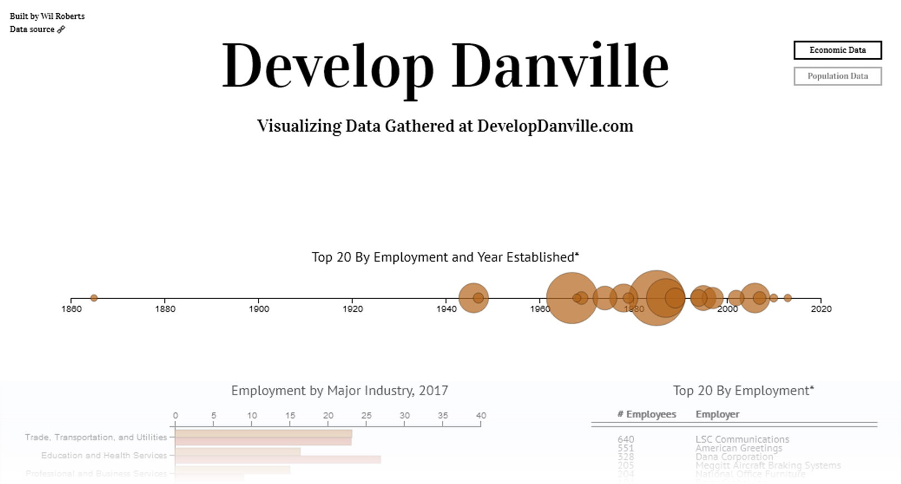

# develop-danville-vis

I moved to a new town and came across some [data](https://www.developdanville.com/) from the local economic development organization. In small towns like mine, the work they do is vitally important.

I thought it was an interesting subject for honing my skills with [D3.js](https://d3js.org/), so I built a fairly simple but aesthetically satisfying interactive visualization. It's deployed live [here](https://develop-danville-vis.herokuapp.com) on Heroku.
